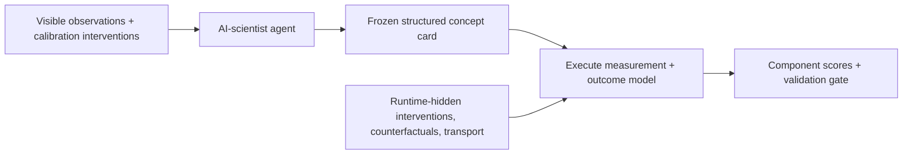

# Causal Scientist Evals

**A research prototype demonstrating a structured, executable causal-hypothesis evaluation design for AI-scientist agents.**

Most scientific-agent benchmarks reward a correct prediction, a plausible hypothesis, or a persuasive report. Those outcomes do not by themselves show that an agent has found a useful way to represent a problem. This repository explores a stricter question:

> Can an agent introduce a concept that clarifies causal structure and continues to help under interventions, counterfactuals, new environments, and independent measurements?

The project is new and intentionally small. It provides benchmark-building and deterministic reference tooling; it does **not** report measured performance for any language model or claim that current models can discover new science.

## What counts as a concept?

A name or verbal description is not enough. A proposal is treated as an **executable concept** only when it states:

- its domain and type;
- a measurement procedure or encoder;
- an executable outcome model that must use the proposed concept;
- an uncertainty model;
- its proposed causal role;
- an intervention map, or a reason the concept is not directly manipulable;
- the environments or regimes in which it should apply;
- predictions that follow from using it; and
- observations that would falsify it.

This “concept card” makes the numeric hypothesis runnable: the scorer executes the declared measurement and outcome model rather than trusting submitted prediction numbers. It also exposes complexity that can otherwise be hidden inside a learned representation or an elaborate measurement procedure.

## What the benchmark is designed to test

An episode separates evidence available to the agent from **runtime-hidden evaluation evidence**. In the public development case, targets are visible in the repository but are never placed in the model prompt or metadata. A candidate concept can then be tested on:

1. **Interventions** — does it improve predictions when a variable is deliberately changed?
2. **Counterfactuals** — does it support internally consistent answers about what would have happened under another action?
3. **Held-out environments** — does its causal role transport when nuisance correlations or mechanisms change?
4. **Independent measurements** — can the concept be recovered or checked without reusing the same encoder and observations that proposed it?

Version 0.1 reports an absolute, component-level prototype score and contrasts it with disclosed hand-authored reference fixtures; those fixtures are not matched model baselines. The longer-term target is incremental causal value under matched access and compute, not eloquence. Useful signals can include interventional prediction, causal-abstraction consistency, transport, modularity, sparsity, stability, total description length (including the encoder), or expected information gain for a follow-up experiment.

The default v0.1 environment is a deterministic causal-mediation development problem. Two disclosed calibration interventions make the key mechanism identifiable before the agent commits to its proposal. Separate runtime-hidden crossed interventions, unit-level counterfactuals, and a changed treatment policy test generalization. Independent-measurement suites remain a methodology target rather than a feature of the default generator.



## Novelty is not one thing

The benchmark keeps several claims separate:

| Dimension | Question |
| --- | --- |
| Historical novelty | Was the idea absent from the relevant prior scientific record? |
| Representational novelty | Does it introduce a non-equivalent representation rather than a change of coordinates? |
| Granularity novelty | Does it reveal a useful level of abstraction or decomposition? |
| Operational novelty | Does it supply a new way to measure, encode, or intervene? |
| Causal utility | Does it improve sealed causal tests beyond appropriate baselines? |

Historical novelty requires an external, time-bounded literature audit and cannot be established by benchmark performance alone. In this prototype, **causal utility is the central empirical criterion**.

## Failure modes the evaluation should reject

- **Renaming:** a new label for an existing variable or relationship.
- **Invertible reparameterization:** a coordinate change with no new causal consequences.
- **Lookup-table latent:** an encoder that memorizes cases while hiding its complexity.
- **Post-hoc story:** an explanation fitted after sealed outcomes are revealed.
- **Unscoped claim:** a concept with no domain of validity or falsifier.

See [Methodology](docs/METHODOLOGY.md) for the proposed evaluation protocol and [Limitations](docs/LIMITATIONS.md) for what results would—and would not—support.

## Repository map

| Path | Purpose |
| --- | --- |
| [`schema.py`](src/causal_scientist_evals/schema.py) | Typed, serializable concept cards and executability checks |
| [`simulator.py`](src/causal_scientist_evals/simulator.py) | Deterministic SCM, sealed cases, and reference proposals |
| [`scoring.py`](src/causal_scientist_evals/scoring.py) | Auditable component scores and anti-gaming penalties |
| [`dataset.py`](src/causal_scientist_evals/dataset.py) | Reproducible JSONL benchmark generation |
| [`baselines.py`](src/causal_scientist_evals/baselines.py) | Empty, renaming, lookup-table, and compact-oracle references |
| [`inspect_task.py`](src/causal_scientist_evals/inspect_task.py) | Optional Inspect AI task and deterministic scorer adapter |
| [`docs/`](docs/) | Methodology, interpretation boundaries, and limitations |
| [`uv.lock`](uv.lock) | Reproducible dependency resolution for development and Inspect extras |

## Quick start

Requires Python 3.11 or newer.

```bash
python -m venv .venv
source .venv/bin/activate
python -m pip install --upgrade pip
python -m pip install -e .
```

Generate the prototype benchmark:

```bash
causal-eval generate --output data/benchmark.jsonl
```

Run deterministic reference baselines:

```bash
causal-eval baselines --output results/baseline_summary.json
```

Run the standard-library test suite:

```bash
python -m unittest discover -s tests -v
```

The generated files are local artifacts. They should be inspected together with the configuration, benchmark version, and code revision that produced them; a summary score without episode-level outputs is not sufficient evidence.

The core evaluator can also be used directly:

```python
from causal_scientist_evals.scoring import score_proposal
from causal_scientist_evals.simulator import build_default_benchmark, oracle_proposal

benchmark = build_default_benchmark()
proposal = oracle_proposal(benchmark)
breakdown = score_proposal(proposal, benchmark)
print(breakdown.to_dict())
```

`oracle_proposal` is a deterministic reference implementation for testing the harness, not an AI-system result.

## Optional Inspect AI workflow

The repository includes an optional [Inspect AI](https://inspect.aisi.org.uk/) adapter for reproducible model runs. Install the extra and run the registered task:

```bash
python -m pip install -e ".[inspect]"
```

```bash
inspect eval causal_scientist_evals/sealed_interventions \
  --model <provider/model>
```

A local smoke test can use Inspect's mock model without making a provider request:

```bash
inspect eval causal_scientist_evals/sealed_interventions \
  --model mockllm/model --limit 1 --display none
```

The adapter keeps runtime-hidden outcomes in the scorer target, requests one structured concept card, executes its measurement and outcome model, and applies evaluator-controlled tolerances. Model reports should record the model identifier, prompt/template version, tool access, sampling parameters, token and retry budgets, code revision, benchmark version and seed when applicable, and Inspect version. This repository includes no measured language-model results and makes no empirical claim about any model.

The optional `dataset_path` task argument accepts only records compatible with the versioned `treatment-gate-v1` structure; v0.1 is not a generic arbitrary-SCM loader.

## Design principles

- **Separation:** proposal generation and scoring use different evidence.
- **Executability:** every concept must expose how it is measured and tested.
- **Reference contrasts:** v0.1 exposes hand-authored oracle, renaming, lookup, and empty fixtures; matched model comparisons are future work.
- **Component reporting:** interventional, counterfactual, transport, and complexity results remain visible rather than being hidden in one number.
- **Falsifiability:** a proposal must state what outcome would count against it.
- **Auditability:** seeds, configurations, raw proposals, parser failures, and episode-level scores should be retained.

## Project status

This repository is a portfolio-scale research prototype, not a mature benchmark or safety certification. Its immediate purpose is to make the evaluation thesis concrete, inspectable, and testable. The public v0.1 case cannot support model rankings or contamination-resistant claims. Important next steps include private generated families, independently authored environments, blinded human review, stronger semantic-equivalence checks, calibrated uncertainty scoring, preregistered aggregation rules, and adversarial validation.

## License

Released under the [MIT License](LICENSE).
